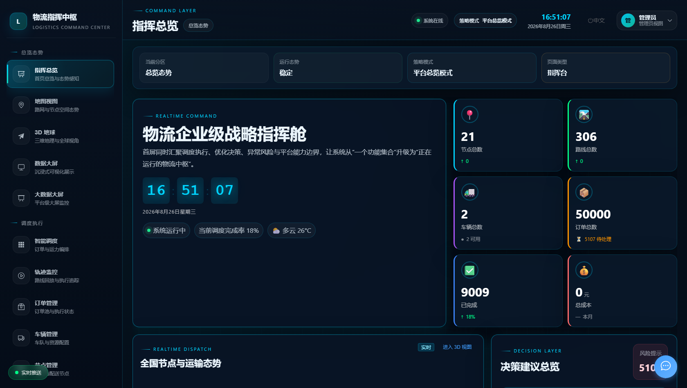
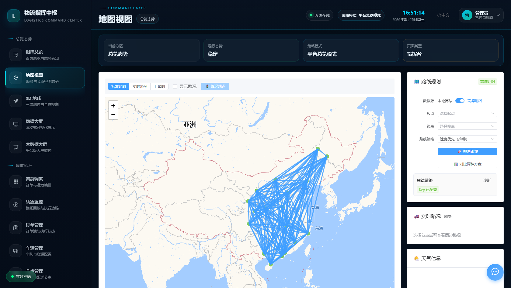
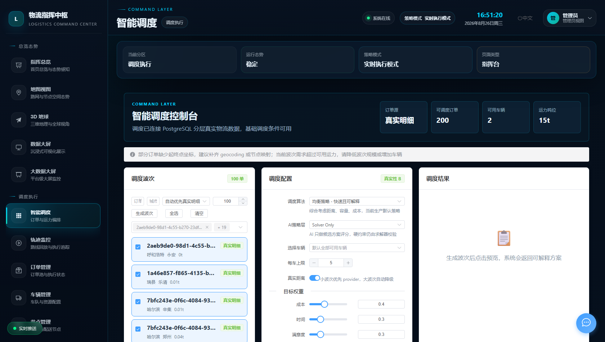
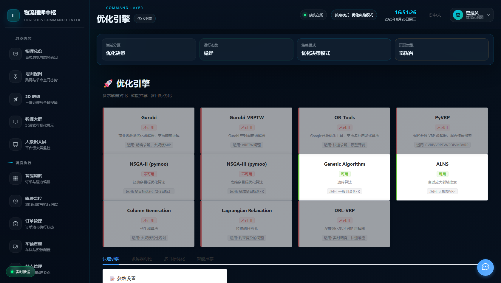
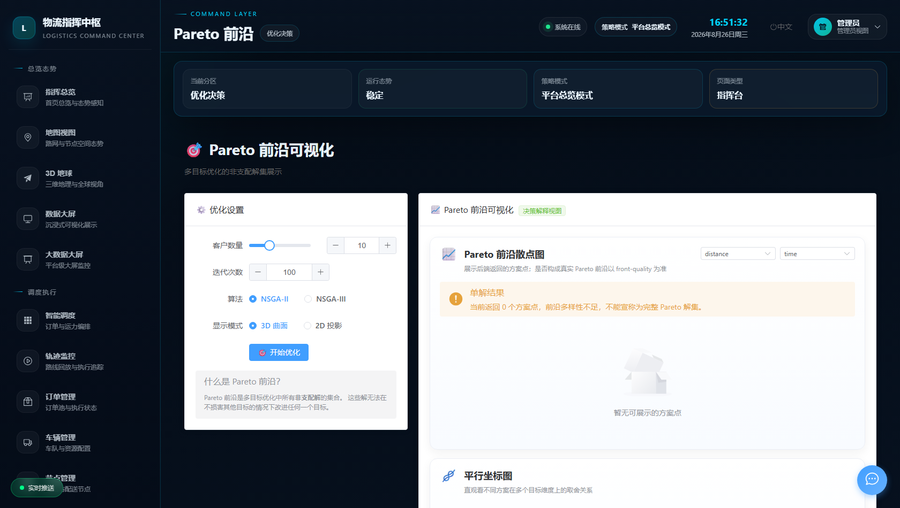
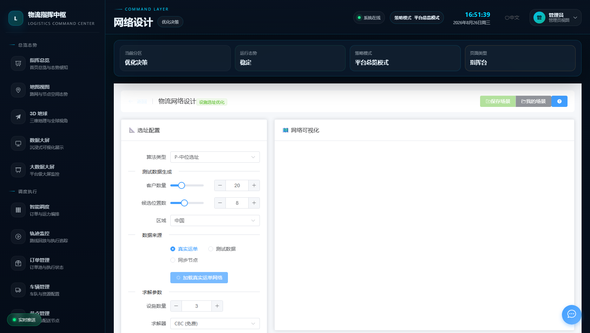
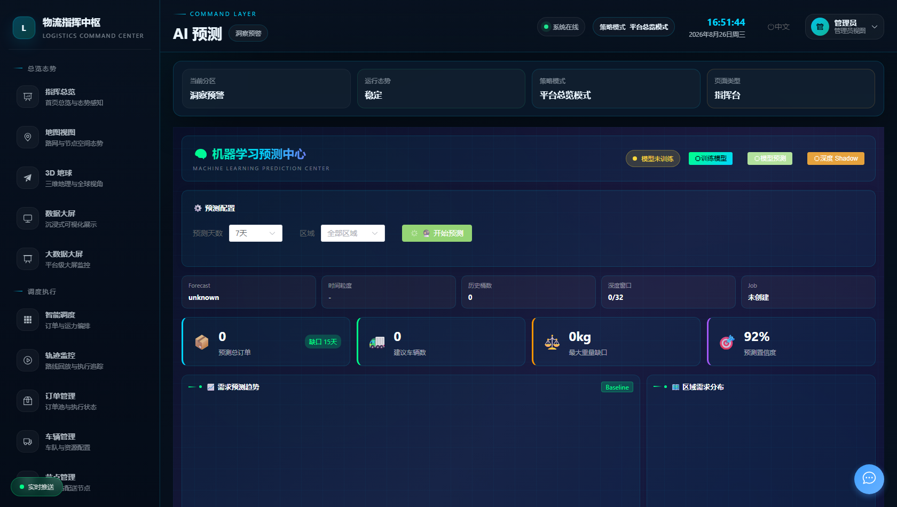
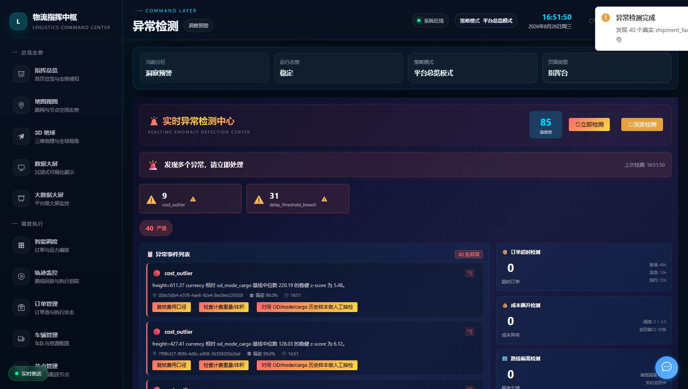
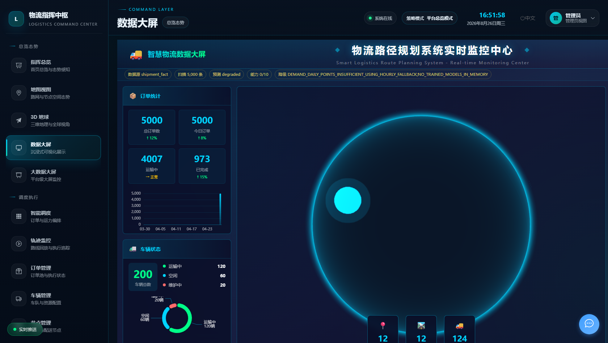
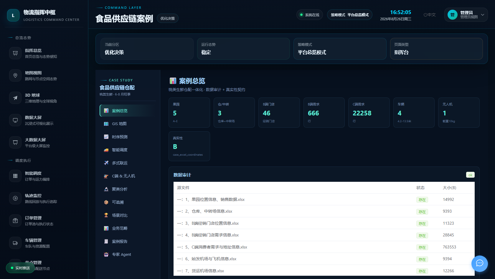

# 🚚 物流路径规划与指挥中枢系统
## Intelligent Logistics Route Planning & Command Center

> 🌐 **[在线演示](https://logistics-demo-yu.top)** · 账号 `admin` / `admin123`
>
> 以 **5 万条真实运单明细（PostgreSQL/PostGIS）** 为数据底座，融合 **Gurobi / OR-Tools / pyVRP / NSGA-II 多求解器运筹优化**、**AI 预测 / 异常检测 / 强化学习 Shadow 决策** 与 **高德/天地图/OSM/PostGIS 四级地图 Provider 真实性分级** 的企业级物流指挥中枢。



---

## 📖 目录

- [项目简介](#-项目简介)
- [在线演示](#-在线演示)
- [三大核心能力](#-三大核心能力)
- [系统架构与技术栈](#-系统架构与技术栈)
- [功能模块详解](#-功能模块详解)
  - [指挥总览与可视化](#一指挥总览与可视化)
  - [调度执行](#二调度执行)
  - [运筹优化决策](#三运筹优化决策)
  - [AI 智能体系](#四ai-智能体系)
  - [地图 / GIS 与路线真实性](#五地图--gis-与路线真实性)
  - [洞察与预警](#六洞察与预警)
  - [食品供应链案例](#七食品供应链案例端到端)
  - [平台治理与运维](#八平台治理与运维)
  - [移动端（微信小程序）](#九移动端微信小程序司机端)
- [运筹优化求解体系（深度）](#-运筹优化求解体系深度)
- [AI 能力体系（深度）](#-ai-能力体系深度)
- [数据底座与真实性元数据契约](#-数据底座与真实性元数据契约)
- [快速开始](#-快速开始)
- [生产部署](#-生产部署)
- [测试与质量保障](#-测试与质量保障)
- [API 概览](#-api-概览)
- [项目结构](#-项目结构)
- [设计原则与工程边界](#-设计原则与工程边界)
- [许可证](#-许可证)

---

## 📌 项目简介

本项目是一个面向物流企业运输调度与仓网决策场景的**企业级物流指挥中枢（Logistics Command Center）**，覆盖"订单 → 波次 → 车辆 → 路线 → 节点"全业务要素，实现从**数据底座 → 运筹求解 → AI 增强 → 可视化决策 → 生产部署**的完整闭环。

系统不是"功能演示集合"，而是一套**正在运行的生产系统**：

- **真实数据**：PostgreSQL/PostGIS 主库承载 **50,000 条真实物流运单明细（`shipment_facts`）**、21 个节点、306 条路线，所有调度、预测、异常检测、成本分析均以真实事实表为唯一主源，旧 `orders` 表仅作兼容来源。
- **运筹优化**：Gurobi 精确 MILP（车辆分配 / VRP / CFLP 选址）、OR-Tools CVRP/CVRPTW、pyVRP、pymoo NSGA-II、遗传/蚁群/粒子群/模拟退火等元启发式算法统一注册进优化引擎，配合求解器推荐引擎与结果评估器自动选路。
- **AI 增强**：需求/ETA/延迟/成本四条预测基线、多维异常检测、DQL/DQN 强化学习 **Shadow 模式**（只评分、重排、建议，硬约束永远由 solver 层保底）、MiniMax-M3 专家 Agent 网关（只读工具预演 + 人工确认）。
- **真实性分级**：高德/天地图/OSM/PostGIS/本地算法多 Provider 统一返回 `distance_source` / `path_source` / `authenticity_level(A/B/C)` / `fallback_reason`，**估算路径绝不伪装成真实道路导航**。
- **生产部署**：Docker Compose 编排（PostgreSQL + Redis + Flask + Nginx/Vue）部署于腾讯云，公网域名访问，`/api/ready` 一键暴露运行时能力矩阵与演示就绪度评分。

**一句话概括**：把"运筹优化求解 + AI 决策 + 真实物流数据 + 地图真实性治理"装进一个可公网访问、可解释、可审计的指挥中枢。

---

## 🌐 在线演示

| 项 | 值 |
|---|---|
| 演示地址 | <https://logistics-demo-yu.top> |
| 管理员账号 | `admin` / `admin123`（全功能） |
| 司机账号 | `driver` / `driver123`（小程序端） |
| 部署形态 | 腾讯云 · Docker Compose · HTTPS |

> 演示环境运行真实 PostgreSQL 数据（`shipment_facts=50000`），调度预览默认 `persist:false` 不落库，**确认执行**才会写入 `dispatch_scenarios` / `dispatch_assignments`。

### 界面速览

| 指挥总览 | 地图视图 |
|---|---|
|  |  |
| **智能调度** | **优化引擎** |
|  |  |
| **Pareto 前沿** | **网络设计（选址）** |
|  |  |
| **AI 预测** | **AI 异常检测** |
|  |  |
| **数据大屏** | **食品供应链案例** |
|  |  |

---

## 🧭 三大核心能力

```text
┌─────────────────────────────────────────────────────────────────┐
│                      物流指挥中枢 Command Center                  │
├──────────────────────┬──────────────────────┬───────────────────┤
│     🚛 物流业务       │    🎯 运筹优化求解     │    🧠 AI 智能      │
├──────────────────────┼──────────────────────┼───────────────────┤
│ · 订单/车辆/节点/路线 │ · Gurobi 精确 MILP    │ · 需求/ETA/延迟/成本│
│ · 波次化调度编排      │ · OR-Tools CVRPTW     │   四条预测基线      │
│ · 轨迹回放与执行追踪  │ · pyVRP / NSGA-II     │ · 多维异常检测+解释 │
│ · 供应商/合同/对账    │ · GA/ACO/PSO/SA 元启发│ · DQL/DQN RL Shadow │
│ · 司机端小程序        │ · 求解器推荐引擎       │ · 奖励模型/重调度仿真│
│ · 食品供应链案例      │ · 真实 Pareto 前沿     │ · MiniMax-M3 Agent  │
│ · 成本/碳排/油价分析  │ · P-中位/覆盖/CFLP 选址│ · 能力探测 10/10    │
├──────────────────────┴──────────────────────┴───────────────────┤
│        数据底座：PostgreSQL/PostGIS 50,000 真实运单 + Redis       │
│        真实性契约：authenticity_level A/B/C + fallback_reason     │
└─────────────────────────────────────────────────────────────────┘
```

---

## 🏗 系统架构与技术栈

```text
                    ┌──────────────────────────┐
                    │   微信小程序（司机端）      │
                    └────────────┬─────────────┘
┌──────────────┐    ┌────────────▼─────────────┐    ┌──────────────────┐
│  Vue 3 前端   │◄──►│      Flask 3 后端         │◄──►│ PostgreSQL/PostGIS│
│  36 视图      │API │  56 路由蓝图 · 94 服务模块  │ORM │ shipment_facts    │
│  Element Plus │WS  │  JWT · SocketIO · 熔断限流 │    │ 50,000 真实运单    │
│  ECharts      │    └──┬──────┬──────┬──────┬─┘    └──────────────────┘
│  AMap/Leaflet │       │      │      │      │    ┌──────────────────┐
│  Three.js     │       ▼      ▼      ▼      ▼    │      Redis        │
└──────────────┘   Gurobi  OR-Tools  pyVRP  pymoo └──────────────────┘
                   ┌──────────────────────────────────────────────┐
                   │ 地图 Provider：高德 / 天地图 / OSM / PostGIS    │
                   │ AI：LSTM/GRU/Transformer Shadow · DQL/DQN     │
                   │ 大数据（可选）：Kafka/Spark/Flink/ES/ClickHouse │
                   └──────────────────────────────────────────────┘
```

| 层 | 技术 | 规模 |
|---|---|---|
| 后端 | Python 3.10+ · Flask 3 · SQLAlchemy 2.0 · Flask-JWT-Extended · Flask-SocketIO | 56 个路由蓝图 · 94 个服务模块 · 150+ REST API |
| 前端 | Vue 3 (Composition API) · Vite · Element Plus · Pinia · ECharts 5 · Leaflet · 高德 JS API 2.0 · Three.js | 36 个业务视图 · 中英双语 · 深色指挥舱主题 |
| 决策控制台 | Next.js App Router（`frontend-next/`，历史参考与迁移素材） | AI 预测 / 异常 / 调度 / 选址 / 路线对比页 |
| 移动端 | 微信小程序原生框架（司机作业流） | 派单 · 电子签收 · GPS 轨迹上报 · 语音 |
| 数据库 | PostgreSQL / PostGIS（主）· SQLite（兼容兜底） | `shipment_facts` 50,000 · nodes 21 · routes 306 |
| 缓存 | Redis（缓存 / 限流 / 实时状态） | 可视化监控页 |
| 优化求解 | Gurobi · CPLEX(docplex) · OR-Tools · pyVRP · PuLP · pymoo · Optuna | 能力探测 10/10 可用 |
| AI/ML | scikit-learn · LightGBM · PyTorch · Stable-Baselines3 · Gymnasium · Transformers | Shadow 运行边界 |
| 大数据（可选） | Kafka · Spark · Flink · Elasticsearch · ClickHouse · Grafana | 保留目录，核心部署默认不启动 |
| 运维 | Docker Compose（prod）· 腾讯云部署脚本 · 企业级冒烟 harness（50 端点） | `/api/ready` 能力矩阵 |

---

## 📦 功能模块详解

### 一、指挥总览与可视化

首屏为深色"物流企业级战略指挥舱"，将调度执行、优化决策、异常风险与平台能力边界压缩到一个页面：

- **实时指标卡**：节点 / 路线 / 车辆 / 订单 / 完成率 / 总成本，WebSocket 实时推送。
- **全国节点与运输态势**：仓库 / 配送站 / 客户点分层渲染，一键进入 3D 视图。
- **决策建议总览**：风险提示计数 + 推荐调度策略（如"高压订单优先"）+ 履约率 / 待调度 / 可视运力。
- **实时订单与事件流**：脱敏订单事件滚动。
- **订单趋势 / 状态分布 / 运输效率雷达 / 天气影响**（ECharts）。
- **实时油价**：分省 92/95/98/0# 柴油价格与趋势（影响成本模型输入）。
- **平台能力总览矩阵**：六大能力域（调度 / 优化 / 地图 / 风险 / AI / 平台）状态一眼可见。
- **数据大屏 / 大数据大屏**：沉浸式汇报级可视化；**3D 地球**（Three.js）多车轨迹动画。


### 二、调度执行

统一调度引擎（`dispatch_orchestration_service`）替代旧散点调度，形成完整闭环：

| 端点 | 能力 |
|---|---|
| `GET /api/dispatch/health` | 真实数据源（`shipment_facts`/`orders` 双源适配）、可调度数量、不可调度原因、truth metadata |
| `POST /api/dispatch/waves` | 按筛选条件创建调度波次，**避免 5 万单一次性求解** |
| `POST /api/dispatch/preview` | 生成调度预览（支持 `persist:false`，页面刷新不写库）；返回 `plans` / `unassigned_orders` / `diagnostics` / `constraint_validation` |
| `POST /api/dispatch/apply` | 确认执行后写入 `dispatch_scenarios` / `dispatch_assignments`（回放、审计、AI 训练样本落点） |
| `GET /api/dispatch/scenarios/:id` | 历史场景回放 |

- **未分配可解释**：每条未分配订单带 `reason`（车辆容量、时间窗、坐标缺失等），聚合到 `diagnostics.reason_counts`，绝不返回"无解释的 0 单"。
- **轨迹监控**：路线回放与执行追踪；订单 / 车辆 / 节点 / 路线全量 CRUD 管理页。


### 三、运筹优化决策

> 深度说明见 [运筹优化求解体系（深度）](#-运筹优化求解体系深度)。

- **优化引擎**：多求解器统一注册与对比求解（Gurobi / OR-Tools / pyVRP / 元启发式），真实 `shipment_facts` OD 聚合样本驱动。
- **多目标优化 + Pareto 前沿**：NSGA-II 真实多目标搜索，成本-时效-碳排权衡可视化，方案对比与场景复盘。
- **高级路径**：约束强化与高级求解（ACO / PSO / SA / 禁忌搜索）。
- **敏捷优化**：快节奏方案迭代与智能拼单。
- **网络设计**：P-中位选址 / 集合覆盖 / CFLP 容量受限选址 / 多目标选址 / 动态多时期选址，支持**真实运单网络**一键加载与求解器选择（CBC / Gurobi）。


### 四、AI 智能体系

> 深度说明见 [AI 能力体系（深度）](#-ai-能力体系深度)。

- **AI 预测**：需求 / ETA / 延迟 / 成本四条真实数据基线 + 时间粒度审计 + LSTM/GRU/Transformer 深度 Shadow 任务 + 运力缺口 / 成本波动预测 + AI Readiness 记分卡。
- **AI 异常检测**：状态 / 地理 / 成本 / ETA / 延迟 / OD 流量 / 节点拥堵多维检测 + IsolationForest 可选增强 + 逐条解释。
- **智能决策中枢**（`/decision-console`）：Vue 原生 AI 增强融合页，聚合 AI 能力雷达、预测曲线、异常信号、调度学习链与 RL Shadow 面板。
- **专家 Agent**：MiniMax-M3 网关，工具只读预演 + 业务写入需人工确认，无 key 时透明降级。


### 五、地图 / GIS 与路线真实性

- **多 Provider 统一抽象**：高德（JS API 2.0 + Web 服务）、天地图、OSM（GraphML 缓存 / OSMnx）、PostGIS、本地图算法（Dijkstra / A*）。
- **真实性分级合同**：每个路线/距离结果必带 `provider_status` / `distance_source` / `path_source` / `authenticity_level(A/B/C)` / `fallback_reason`：
  - **A 级**：Provider 真实道路 polyline（如高德 driving_route 成功）；
  - **B 级**：真实路网距离矩阵 + 估算几何；
  - **C 级**：Haversine / 投影估算，明确标注不可当导航。
- **Provider 健康**：`/api/amap/provider-health?probe=1` 汇总路线 / 天气 / 路况状态；距离缓存统计与 OD 验证；天地图只暴露 key 状态绝不暴露 key 值。
- **本地路径基准**：`/api/amap/route/local-benchmark` 将本地 Dijkstra/A* 结果与 Provider 真实路线同台对比。
- **坐标审计**：节点/路线坐标审计、解析与距离回填脚本，治理脏坐标。


### 六、洞察与预警

- **预警中心**：订单超时、成本异常、天气影响告警流，健康度评分。
- **风险管理**：风险评估矩阵 + CBA 决策模型，风险画像与策略干预。
- **异常检测**：Z-score 路线偏离预警，实时识别与追踪。
- **成本分析**：燃油 / 路桥 / 人工多维分解，历史趋势，联动实时油价。
- **数据分析总览**：统计报表与表现监控，全部接真实 `shipment_facts` 摘要（列级投影 + 分块迭代，杜绝 5 万单全量 ORM 加载拖垮后端）。
- **碳足迹**：排放计算、车型对比、绿色路线推荐。

### 七、食品供应链案例（端到端）

独立案例模块 `/cases/food-supply`（12 个子页面：GIS 网络 / 预测 / 调度 / 多式联运 / C2C / 聚类 / 溯源 / 场景 / 业务 / 报告 / Agent），是"理论建模 → 算法求解 → 系统落地"的浓缩样板：

- **真实案例数据**：读取 9 个 Excel 工作簿（果园、仓/中转场、B 端门店、B/C 端需求、机场/飞机、车辆、无人机），落专属 `case_food_*` 表，与生产 `shipment_facts` 物理隔离；PostGIS 几何列 + GiST 索引自动物化。
- **多求解器真跑**：`solver_mode=milp`（Gurobi CFLP MILP）/ `ortools`（CVRP）/ `pyvrp`（bounded CVRP）/ `algorithm_family=nsga`（pymoo NSGA-II）。
- **距离矩阵多源适配**：`matrix_mode=amap|tianditu|osm|postgis|haversine|auto`，逐 pair 标注来源，缺图明确降级。
- **调度动画回放**：高德 polyline 帧动画（播放/暂停/速度控制）+ 鲜度衰减曲线同步，`animation_frame_count` 契约。
- **数学模型面板**：`food_fresh_vrptw_mo_v2` 集合 / 决策变量 / KaTeX 多目标 VRPTW 公式 / 硬软约束 / 复杂度 / truth notes。
- **权重实验台**：成本 / 鲜度 / 时效 / 碳排 / 均衡 5 权重滑杆即时重评分（同方案 rescore，明确标注非求解器 Pareto），一键按当前权重重算或生成 greedy / OR-Tools / PSO 候选对比。
- **路线来源对比**：同一 OD 返回高德 / 天地图 / OSM / Haversine 多行结果，带质量评分（`quality_score` / `score_breakdown`）与缓存历史。


### 八、平台治理与运维

- **用户权限**：JWT 认证 + 多角色（管理员 / 用户 / 司机）+ 用户管理页。
- **审计日志**：关键操作留痕（IP / 用户 / 时间戳）与追溯页。
- **供应商管理**：档案、四维绩效评估（卡拉杰克矩阵）、合同到期提醒、对账结算。
- **数据采集 / Redis 监控 / 大数据分析**：采集链路任务状态、缓存实时监控、流处理平台监控。
- **测试数据**：一键填充演示数据。
- **运行时可观测**：
  - `GET /api/ready`：数据库运行态 + `shipment_facts` 计数 + `registered_capabilities`（高级 ML / Agent / GIS / Decision 注册情况）+ `demo_readiness`（就绪度评分）。
  - `GET /api/runtime/capabilities`：Gurobi / CPLEX / OR-Tools / pymoo / Torch / SB3 / Optuna / LightGBM / Transformers / GeoPandas **10 项可选能力安全探测**（只报可用性 / 版本 / 边界，不返回任何 key 或 license）。
  - `backend/scripts/enterprise_smoke_harness.py`：50 端点企业级冒烟，区分 `auth_required` / `route_missing` / `failed`。
  - 服务层工程化：熔断器（circuit breaker）、重试策略、可靠性层、指标采集、异常策略、数据质量报告服务。

### 九、移动端（微信小程序·司机端）

- 派单通知（声音 + 震动，接单 / 拒单）
- 电子签收（Canvas 手写签名 + 拍照上传 + GPS 水印）
- 轨迹上报（定时定位、断网缓存、电量优化）
- 订单概览与快捷作业流

---

## 🎯 运筹优化求解体系（深度）

### 求解器矩阵与统一注册

| 求解器 | 类型 | 应用场景 | 入口 |
|---|---|---|---|
| **Gurobi** | 精确 MILP | 车辆分配、小规模 VRP、CFLP 选址、网络设计 | `/api/optimization/gurobi/vehicle-assignment` `/vrp` `/network-design` `/smoke` `/health` |
| **CPLEX (docplex)** | 精确 MILP | 备选精确求解器（能力探测自动发现） | 能力矩阵 + 求解器推荐 |
| **OR-Tools** | VRP 专用 | CVRP / CVRPTW 大邻域搜索 | 优化引擎 / 食品案例 dispatch |
| **pyVRP** | 元启发 VRP | bounded CVRP（杂交遗传） | 食品案例 / benchmark |
| **PuLP** | 建模层 | LP/MIP 快速建模 | 内部服务 |
| **pymoo NSGA-II** | 多目标进化 | 真实 Pareto 前沿搜索 | `/multi-objective` `/pareto-front` |
| **GA / ACO / PSO / SA / 禁忌** | 元启发式 | 高级路径、敏捷优化、智能拼单 | `/advanced-route` `/agile` |

### 关键工程设计

1. **能力探测优先于假设**（`gurobi_capability_service`）：比 import 更严格的运行时探测；Gurobi 不可用时返回明确 `fallback_reason`，绝不伪装精确求解成功。
2. **求解器推荐引擎**（`solver_recommendation_engine`）：按问题规模 / 结构 / 可用运行时自动推荐求解路径；`result_evaluator` 对解质量做统一评估；`benchmark_runner` 支撑 `/api/optimization/solver-benchmark` 与 `/api/optimization/route-sequence-benchmark`。
3. **规模边界纪律**：小规模 VRP/CFLP/车辆分配走精确 MILP；**全量 5 万单不直接送入精确求解器**，通过波次（waves）+ 抽样聚合（`real-shipment-demo` 将真实城市 OD 聚合投影到可求解规模，并标注 `shipment_fact_city_od_aggregate` 来源）控制问题规模。
4. **异构 VRP 建模**（`optimization_engine/heterogeneous_vrp_models` + `vrp_problem_builder`）：支持异构车队、容量、时间窗的结构化问题构建。
5. **真实 Pareto 治理**（`pareto_governance_service` / `multi_objective_targets`）：多目标结果经过治理校验，前端展示真实非支配解而非"伪 Pareto"。
6. **质量与推荐治理**（`quality_governance_service` / `recommendation_governance_service`）：方案质量评分与推荐理由可审计。

### 选址定容（网络设计）

| 模型 | 说明 |
|---|---|
| P-中位选址 | 最小化总加权距离 |
| 集合覆盖 | 最少设施覆盖全部需求点 |
| CFLP | 容量受限设施选址（Gurobi 精确 MILP 真跑） |
| 多目标选址 | 成本 + 距离 + 均衡性权衡 |
| 动态选址 | 多时期规划 + 扩张优化 |

支持从真实 `shipment_facts` 目的城市聚合生成客户点与候选设施（`/api/network/real-shipment-dataset`），数据来源与真实性等级全程可追溯。

---

## 🧠 AI 能力体系（深度）

### 预测（`/api/ai-prediction/*`）

- **四条真实基线**：需求（demand）/ ETA / 延迟（delay）/ 成本（cost），全部基于 `shipment_facts` 列级投影读取。
- **时间轴审计先行**（`/timeline/audit`）：预测前置审计各时间字段覆盖率、推荐粒度、训练窗口；真实数据时间轴不足时**自动降级并说明**（如日级点不足 → `forecast_status=degraded` + `fallback_reason=DEMAND_DAILY_POINTS_INSUFFICIENT_USING_HOURLY_FALLBACK`），前端如实展示降级原因，绝不显示"无解释的 0"。
- **深度模型 Shadow 任务**（`/jobs`）：LSTM / GRU / Transformer 后台训练入口，readiness 不足时任务完成但标记 degraded，不阻塞请求、不写业务表。
- **衍生预测**：运力缺口预测、成本波动预测、时间序列 benchmark、特征数据集导出、AI Readiness 记分卡。

### 异常检测（`/api/ai-anomaly/*`）

- 七维检测：status / geo / cost / ETA / delay / OD volume / node congestion。
- **IsolationForest 可选增强**：无 scikit-learn 时接口明确解释降级原因。
- **逐条解释**（`/explain`）：每条异常给出可读成因，而非裸分数。

### 强化学习 Shadow（`/api/dispatch/*`）

> **核心边界：DQL/DQN 永远是建议层（`deployable=false`），容量、订单唯一分配、车辆可用性、时间窗、路径可行性等硬约束必须由 solver 层保底；Shadow 策略不写任何业务表。**

| 端点 | 能力 |
|---|---|
| `/learning-dataset` | 已落库场景/分配 → `rl_shadow_dataset_v1` 训练数据集 |
| `/policy-scorer` | historical / balanced / utilization-first / reliability-first / risk-averse / cost-guarded 多策略评分对比 |
| `/reward-model` | 轻量 `linear_reward_ranker_v1` 离线奖励基线训练 |
| `/redispatch-simulator` | 延误 / 车辆不可用 / 成本放大 / provider 降级等**只读**动态重调度模拟 |
| `/rl-shadow-runner` `/fitted-q-shadow-model` `/shadow-benchmark` | DQL / Fitted-Q 前置 shadow 验证链路 |
| `/preview?policy_mode=dqn_shadow` | 返回 `solver_plan` + `rl_rerank` + `constraint_validation`，DQN 重排永远 `deployable=false` |
| `/policy/jobs` | DQN / Fitted-Q / PPO shadow 后台任务（手动高级分析，不自动触发） |

### 专家 Agent（`/api/agent/*`）

- MiniMax-M3 网关（OpenAI-style endpoint），key 只从后端环境变量读取。
- **工具只读预演**（`/tools/preview` 返回 `read_only / will_execute=false`），业务写入必须走 `/actions/confirm` 人工确认。
- 无 key 时返回 `provider_status=degraded` + 明确原因，不阻断页面。

### 运行时能力探测

`/api/optimization/capabilities` 对 Gurobi / CPLEX / OR-Tools / pymoo / Torch / SB3+Gymnasium / Optuna / LightGBM / Transformers / GeoPandas 十项能力做安全探测，只返回可用性、版本、能力边界与 fallback 说明。

---

## 🗄 数据底座与真实性元数据契约

### 生产数据规模（已验证）

```text
shipment_facts                  50,000   ← 真实物流明细（唯一调度/预测/分析主源）
raw_logistics_shipment_records  50,000
nodes                           21
routes                          306
vehicles                         2
```

### 真实性契约（Truth Metadata Contract）

所有涉及距离 / 路径 / 数据来源的接口，必须携带并可解释：

| 字段 | 含义 |
|---|---|
| `data_source` / `distance_source` / `path_source` | 数据与距离/路径的真实来源（如 `amap_driving`、`amap_distance_matrix`、`haversine_corrected`、`shipment_fact_od_aggregate`） |
| `authenticity_level` | A（真实道路几何）/ B（真实距离+估算几何）/ C（估算） |
| `provider_status` | ok / degraded |
| `fallback_reason` | 降级原因（如 `AMAP_KEY_MISSING`、`CASE_BASELINE_GRAPHML_NOT_REAL_OSM`） |

**设计立场**：Provider 失败可以降级，但必须解释原因；Haversine 永远不能被包装成真实道路导航。这条契约贯穿调度、地图、案例、优化全链路，并由 20+ 个 truth-source 契约测试守护。

### 工程护栏

- 5 万单读取一律**列级投影 + `yield_per` 分块迭代**，禁止全量 ORM 实体加载（有回归测试 monkeypatch 守护）。
- 页面首屏默认 `interactive` 运行档（prediction/anomaly limit≤5000，anomaly 默认不开 ML）；`full` 档只留给手动深度分析。
- PostgreSQL 连接池护栏（pool size / overflow / statement timeout / idle tx timeout）。

---

## 🚀 快速开始

### 环境要求

- Python 3.10+（推荐 3.11）
- Node.js 18+
- PostgreSQL 14+（含 PostGIS 扩展，推荐）
- Redis（可选，缓存增强）
- Docker / Docker Compose（生产部署用）

### 1️⃣ 克隆项目

```bash
git clone https://github.com/Tyranitar-design/logistics-route-planning.git
cd logistics-route-planning
```

### 2️⃣ 后端

```bash
cd backend
python -m venv .venv
.\.venv\Scripts\activate          # Windows
pip install -r requirements.txt

# 配置数据库（PostgreSQL 优先）
# Windows 本地可用被 git 忽略的 .env.local 注入连接串与地图 key

python run.py                     # 默认 http://127.0.0.1:5000
```

> 无 PostgreSQL 时系统自动以 SQLite 兜底启动（`/api/ready` 会如实显示 `backend=sqlite` 与告警）；真实 5 万单能力需要 PostgreSQL/PostGIS。
> 本地开发建议：`DISABLE_KAFKA_CONSUMER=1` 避免未启动 Kafka 时的刷屏日志。

### 3️⃣ 前端

```bash
cd frontend
npm install
npm run dev -- --host 127.0.0.1 --port 5173
```

### 4️⃣ 访问

- 前端指挥中枢：<http://localhost:5173>（默认登录后进入指挥总览）
- 智能决策中枢：`/decision-console`
- 后端 API：<http://localhost:5000>
- 就绪检查：<http://localhost:5000/api/ready>
- 账号：`admin / admin123`

---

## 🐳 生产部署

### Docker Compose（核心服务）

生产编排 `docker-compose.prod.yml` 只启动核心四件套（大数据容器默认不启动，目录保留）：

```text
PostgreSQL/PostGIS + Redis + Flask Backend + Nginx/Vue Frontend
```

```bash
cp .env.production.example .env.production
chmod 600 .env.production        # 填入 DB 密码 / JWT 密钥 / 高德 key（勿提交！）

docker compose --env-file .env.production -f docker-compose.prod.yml up -d --build

# 验证
curl http://127.0.0.1:5000/api/health
docker compose --env-file .env.production -f docker-compose.prod.yml ps
```

### 腾讯云一键部署

```powershell
python scripts\deploy_tencent_cloud_command_center.py --identity-file <ssh-private-key> --skip-dump
# --verify 只做远程健康检查；--check-only 只检查远端环境
```

> 发布脚本已修复"发布包误打入本地 .venv 导致部署静默卡死"的问题；远端 `.env.production` 会被保留。**严禁**将 `.env.production`、SSH 密钥、数据库密码、地图 key、Gurobi license 提交到仓库。

### 部署后验证清单

```bash
TOKEN=<login-access-token>
curl http://<host>:5000/api/ready                                  # PostgreSQL + shipment_facts=50000 + capabilities.missing=[]
curl -H "Authorization: Bearer $TOKEN" http://<host>:5000/api/dispatch/health
curl -X POST http://<host>:5000/api/dispatch/preview -H "Authorization: Bearer $TOKEN" \
  -H "Content-Type: application/json" \
  -d '{"limit":20,"data_source":"auto","algorithm":"balanced","use_precise_distance":false}'
```

预期响应包含 `plans` / `unassigned_orders` / `diagnostics` / `solver` / `data_source` / `distance_source` / `provider_status` / `authenticity_level`。

---

## ✅ 测试与质量保障

```powershell
# 核心 AI / 分析链路（真实数据列级读取契约）
python -m pytest backend\tests\test_shipment_prediction_service.py `
                   backend\tests\test_shipment_anomaly_service.py `
                   backend\tests\test_shipment_cost_analytics_service.py -q

# 地图 provider 契约 + 本地路径基准
python -m pytest backend\tests\test_amap_phase1_contract.py backend\tests\test_local_route_benchmark_service.py -q

# 调度编排 + 订单路线兼容
python -m pytest backend\tests\test_dispatch_orchestration_layered.py backend\tests\test_order_route_shipment_fact_compat.py -q

# Gurobi 服务族
python -m pytest backend\tests\test_gurobi_capability_service.py backend\tests\test_gurobi_assignment_service.py `
                 backend\tests\test_gurobi_vrp_service.py backend\tests\test_gurobi_network_design_service.py -q

# 企业级 HTTP 冒烟（50 端点，区分 auth_required / route_missing / failed）
python backend\scripts\enterprise_smoke_harness.py --base-url http://127.0.0.1:5000

# 前端构建
cd frontend && npm run build
```

- **契约测试群**：20+ 个 truth-source 契约测试（dispatch / multi-objective / NSGA / network / tracking / smart-dispatch-v2 / optimization-solve 等）守护"真实性元数据不丢失"。
- **OpenSpec 规格驱动**：`openspec/changes/*` 保存历次能力增强的规格与 delta，`openspec validate --strict` 作为变更门禁。

---

## 🔌 API 概览

**56 个路由蓝图 · 150+ 端点**，按域分组：

| 域 | 代表端点 |
|---|---|
| 认证 | `POST /api/auth/login` `register` |
| 调度编排 | `/api/dispatch/health` `waves` `preview` `apply` `scenarios/:id` |
| RL Shadow | `/api/dispatch/learning-dataset` `policy-scorer` `reward-model` `redispatch-simulator` `shadow-benchmark` |
| 优化求解 | `/api/optimization/gurobi/*` `solver-benchmark` `route-sequence-benchmark` `capabilities` `real-shipment-demo` |
| 多目标 | `/api/multi-objective/optimize`、Pareto / 场景对比 |
| 网络设计 | `/api/network/*` `real-shipment-dataset` |
| AI 预测 | `/api/ai-prediction/health` `timeline/audit` `baseline/evaluate` `demand/forecast` `jobs` `scorecard` |
| AI 异常 | `/api/ai-anomaly/health` `detect` `scorecard` `explain` |
| 运营分析 | `/api/analytics/operations-summary` `operations-scorecard` `enterprise-summary` |
| 地图 Provider | `/api/amap/route` `provider-health` `route/local-benchmark` `distance/cache/stats`、`/api/tianditu/keys` `compare/amap` |
| Agent | `/api/agent/chat` `tools/preview` `actions/confirm` `health` |
| 运行时 | `/api/ready` `/api/runtime/capabilities` `/api/gis/provider-health` `/api/decision/scenarios` |
| 业务管理 | `/api/orders` `/vehicles` `/nodes` `/routes` `/suppliers` `/driver/*` |
| 食品案例 | `/api/cases/food-supply/summary` `network` `distance-matrix/build` `dispatch-fresh` `pareto` `routes/compare` `agent/explain` |
| 大数据（可选） | `/api/bigdata/*` `/api/spark/*` `/api/flink/*` `/api/es_search/*` `/api/clickhouse/*` |

---

## 📁 项目结构

```text
logistics-route-planning/
├── backend/                        # Flask 3 后端
│   ├── app/
│   │   ├── routes/                 # 56 个路由蓝图（dispatch/optimization/ai_prediction/...）
│   │   ├── services/               # 94 个服务模块（调度编排/Gurobi/预测/异常/provider/治理）
│   │   │   ├── optimization_engine/   # 统一优化引擎（solver registry / 异构 VRP 模型）
│   │   │   ├── gurobi_*.py            # Gurobi 能力探测/车辆分配/VRP/网络设计
│   │   │   ├── shipment_*_service.py  # 预测/异常/成本分析（真实 shipment_facts）
│   │   │   ├── dispatch_orchestration_service.py
│   │   │   ├── amap_service.py / tianditu_service.py
│   │   │   └── food_supply_case_service.py
│   │   ├── models/                 # SQLAlchemy 模型（含 ShipmentFact）
│   │   └── __init__.py             # App 工厂（checkfirst 增量建表）
│   ├── scripts/                    # enterprise_smoke_harness / init_db / 坐标审计
│   ├── tests/                      # pytest 契约测试群（含 20+ truth-source 测试）
│   └── run.py                      # 启动入口
│
├── frontend/                       # Vue 3 主前端（生产）
│   └── src/
│       ├── views/                  # 36 个视图（DecisionConsole/Dispatch/OptimizationEngine/...）
│       ├── components/             # ParetoScatterPlot / SolverRecommendationCard / DispatchReplayMap ...
│       ├── api/                    # API 封装
│       ├── router/  stores/  utils/  locales/
│       └── ...
│
├── frontend-next/                  # Next.js 决策控制台（历史参考与迁移素材）
├── miniprogram/                    # 微信小程序（司机端）
├── docs/                           # 26+ 篇工程文档（部署/算法/基准/审计/发布）
│   └── screenshots/                # README 界面截图
├── openspec/                       # OpenSpec 规格驱动变更
├── scripts/                        # 部署脚本 / linter / 数据校验
├── deploy/  dags/  flink/  spark-apps/  bigdata-templates/   # 编排与大数据（可选）
├── docker-compose.prod.yml         # 生产编排（核心四件套）
├── docker-compose*.yml             # 开发/大数据可选编排
└── README.md
```

---

## 🛡 设计原则与工程边界

1. **真实数据优先**：核心调度 / 预测 / 异常 / 分析只认 PostgreSQL `shipment_facts`；旧 `orders` 仅作兼容来源。
2. **硬约束归 solver，AI 只建议**：DQL/DQN Shadow 永远 `deployable=false`；容量 / 唯一分配 / 时间窗 / 可行性由 Gurobi/OR-Tools/ALNS 保底。
3. **降级必须可解释**：任何 provider / 求解器 / 模型不可用都返回结构化 `fallback_reason`，禁止无解释降级或伪装成功。
4. **规模边界**：精确 MILP 只用于小规模问题；5 万单通过波次 + 聚合抽样控制规模，来源如实标注。
5. **密钥零入库**：地图 key / DB 密码 / license / SSH 私钥只进被忽略的环境文件；状态类接口只返回"是否配置"，不返回值。
6. **规格驱动 + 契约测试**：OpenSpec 管理变更规格，truth-source 契约测试守护真实性元数据不退化。

---

## 📄 许可证

MIT License

---

<div align="center">

**🚚 物流路径规划与指挥中枢系统 — 让每一单都有可解释的最优解**

*Flask + Vue 3 · Gurobi / OR-Tools / NSGA-II · AI Shadow · PostgreSQL/PostGIS 50,000 真实运单*

[在线演示](https://logistics-demo-yu.top) · `admin / admin123`

</div>
